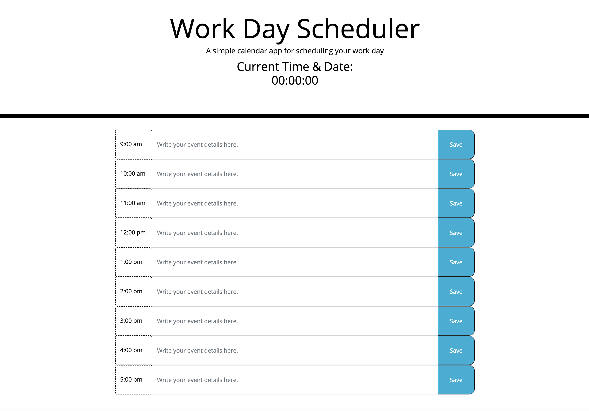

# WorkDayScheduler_Homework_5
Simple calendar application that allows a user to save events for each hour of the work day.

## Goal:
The goal was to use what we learned about third-party APIs in order to build a calendar that saves the user's inputs in the browser. This app needed to include the [Moment.js](https://momentjs.com/) library in order to successfully work with date and time. 

(FINISH WRITING BELOW)

## Issues:
- Getting data to save to local storage
- Getting time to show up correctly from moment.js

## Results:

Utilizing bootstrap was successful as well as creating some JQuery elements. Functions will need to be re-visited and re-worked in order to properly display the timer.

## Summary:
This assignment was interesting. In using bootstrap I discovered that certain built-in html classes cannot be changed without effecting the style of the examples from the bootstrap site. The process for incorporating the moment.js library as well as JQuery were challenging

## Table of Contents
- [Goal](#Goal)
- [Issues](#Issues)
- [Results](#Results)
- [Summary](#Summary)

_____
### License
MIT License, Copyright (c) [2021] [StephanieGaston]

